<div align="center">

# readme-svg-generator

**Dynamic SVG stats, status and tech-stack cards for your GitHub profile README.**

Square corners, hairline rules, monospace type. No headless browser, no canvas, no dependencies -
just XML strings and HTTP caching.

[](https://nodejs.org)
[](package.json)
[](https://vercel.com/new/clone?repository-url=https%3A%2F%2Fgithub.com%2Fyour-name%2Freadme-svg-generator&env=GITHUB_TOKEN&envDescription=GitHub%20token%20used%20by%20the%20stats%20card)
[](#license)








**Live, from the deployment** - real data, and it follows your colour scheme:

<picture>
  <source
    media="(prefers-color-scheme: dark)"
    srcset="https://readme-svg-generator.vercel.app/api/stats?username=JFrusher&theme=dark&width=495" />
  
</picture>

</div>

---

## Why

Most README card services shell out to Puppeteer to screenshot HTML. That is slow, heavy and
expensive to host. Every card here is an SVG document assembled from template strings, so a cold
serverless invocation is a few milliseconds and the whole project installs zero packages.

- **Six cards:** status, tech stack, GitHub stats, contribution heatmap, terminal transcript, repo pin.
- **Six themes** plus per-colour overrides from the query string.
- **One visual system:** square corners, hairline rules, monospace type. No gradients, no shadows,
  no rounded pills.
- **Cached hard:** `max-age=14400`, `stale-while-revalidate=86400`.
- **Safe:** every parameter is escaped or validated before it reaches the XML.
- **Accessible:** `role="img"`, a `<title>`, and animations disabled under `prefers-reduced-motion`.
- **A playground** at `/` to build a card and copy the snippet.

---

## Quick start

### Deploy

[](https://vercel.com/new/clone?repository-url=https%3A%2F%2Fgithub.com%2Fyour-name%2Freadme-svg-generator&env=GITHUB_TOKEN&envDescription=GitHub%20token%20used%20by%20the%20stats%20card)

`.env` is never deployed - Git deploys ship only committed files, and `.env` is gitignored. Set the
variables in the Vercel dashboard instead: Project -> Settings -> Environment Variables, then
redeploy (they bind at build time, so an existing deployment will not pick them up).

| Variable | Required | Purpose |
| --- | --- | --- |
| `GITHUB_TOKEN` | for `/api/stats` | A classic token with no scopes covers public data. Add `repo` only if you want private repos and private contributions counted - that also grants write access to every repo you own, so prefer the narrow token and set an expiry. |
| `ALLOWED_USERS` | strongly recommended | Comma-separated handles `/api/stats` will render. **Without it a deployed instance is an open proxy to the GitHub API**: anyone who finds the URL can render cards for any account and spend your token's 5,000 requests/hour. |

The `/api/card` and `/api/stack` routes never call GitHub, so neither variable affects them.

### Run locally

```bash
git clone https://github.com/your-name/readme-svg-generator.git
cd readme-svg-generator
npm install            # installs nothing - there are no dependencies
cp .env.example .env   # optional, only the stats card reads it
npm run dev            # http://localhost:3000
npm test               # smoke tests for escaping, layout and query parsing
```

`npm run dev` uses a small `node:http` server so you do not need a Vercel account, and loads `.env`
if one is present (Node 20.6+). If you want the real platform behaviour (rewrites, edge headers),
use `npm run dev:vercel`.

Open <http://localhost:3000> for the playground: pick a card, tweak the controls, copy the snippet.

---

## API reference

Base URL is your deployment. Every endpoint also answers on a clean path (`/card`, `/stack`,
`/stats`) thanks to the rewrites in `vercel.json`.

### Shared parameters

| Parameter | Type | Default | Description |
| --- | --- | --- | --- |
| `theme` | `system` \| `dark` \| `light` \| `dracula` \| `catppuccin` \| `tokyo-night` | `system` | Named palette. `system` is the monochrome default. Unknown names fall back to it. |
| `border` | boolean | `true` | Draw the 2px card outline. |
| `width` | integer | `495` | Card width in pixels. Clamped per endpoint. |
| `animate` | boolean | `true` | Stepped reveal, meter fill and the blinking indicator. `false` emits a static card. |
| `bg_color` | hex | theme | Background override, with or without `#`. |
| `text_color` | hex | theme | Body text override. |
| `accent_color` | hex | theme | Titles, values and progress bars. |
| `border_color` | hex | theme | Border override. |
| `cache_seconds` | integer | `14400` | How long the card stays fresh, clamped to 60-86400. Lower it while iterating, raise it when you are done. |

Three cards need a token (`stats`, `heatmap`, `repo`); three do not (`card`, `stack`, `terminal`).

Booleans accept `true`/`false`, `1`/`0`, `yes`/`no`, `on`/`off`, and a bare flag (`?border`) means
true. Invalid colours are ignored rather than injected, so a bad value degrades to the theme.

### `GET /api/card` - status card

| Parameter | Type | Default | Description |
| --- | --- | --- | --- |
| `title` | string | `Available for work` | Headline, max 80 chars. |
| `subtitle` | string | *(empty)* | Second line, max 140 chars. Omitting it shortens the card. |
| `label` | string | `STATUS` | Text in the title bar across the top of the card. |
| `pulse` | boolean | `true` | Blinking square status indicator before the title. |
| `pulse_color` | hex | theme accent | Indicator colour. |
| `width` | integer | `495` | 200-1000. |

```markdown

```

### `GET /api/stack` - tech stack matrix

`categories` names the sections in order; each section's tags come from a parameter named after
it. A category with no matching parameter is skipped.

| Parameter | Type | Default | Description |
| --- | --- | --- | --- |
| `title` | string | `TECH STACK` | Title-bar text, upper-cased. |
| `categories` | comma list | *(all non-reserved params)* | Section names, max 8. |
| `<category>` | comma list | - | Tags for that section, max 24 each. |
| `width` | integer | `495` | 250-1000. Tags wrap to fit; the card grows taller. |

```markdown

```

Omitting `categories` works too - any parameter that is not a card option is treated as a category:

```markdown

```

### `GET /api/stats` - GitHub metrics

Requires `GITHUB_TOKEN` on the server. Results are memoised for 10 minutes per warm instance on top
of the 4 hour edge cache.

Commit totals are **lifetime**, not trailing-year. A `contributionsCollection` covers at most one
year, so the route makes two requests: one for the years the account has contributions in, then one
that aliases a collection per year and sums them.

| Parameter | Type | Default | Description |
| --- | --- | --- | --- |
| `username` | string | **required** | GitHub handle. Invalid handles render an error card. |
| `year` | integer | *(lifetime)* | Scope commits, PRs, issues and contributed-repos to one calendar year. Stars cannot be date-filtered, so they stay lifetime and the row says so. |
| `show_icons` | boolean | `true` | Single-character marker (`*`, `#`, `>`, `?`, `~`) beside each metric. |
| `hide` | comma list | *(none)* | Any of `stars`, `commits`, `prs`, `issues`, `contributed`, `languages`. |
| `exclude_langs` | comma list | *(none)* | Language names to leave out of the breakdown, e.g. `Jupyter Notebook,HTML`. Case-insensitive, max 12. |
| `include_private` | boolean | `true` | Count restricted contributions in the commit total. Needs a token with `repo` scope **and** "Include private contributions on my profile" enabled, or it is always 0. |
| `width` | integer | `495` | 300-1000. |

Metrics: total stars earned, lifetime commits, total PRs, total issues, repositories contributed to,
plus the top five languages by bytes across non-fork repositories, drawn as segmented cell meters.

What the numbers do and do not include:

| Metric | Counts | Does not count |
| --- | --- | --- |
| Stars | Your top 100 owned, non-fork repos | Org-owned repos, forks, repos past the first 100 |
| Commits | Every year the account has contributions in | Nothing - this is the lifetime total |
| PRs / Issues | Everything you authored, anywhere, any state | - |
| Contributed to | Repos you do not own that you committed to | Your own repos |
| Languages | Each repo's own language split, averaged with every repo weighted equally | Repo size - a huge repo counts the same as a small one |

```markdown

```

#### Why the language bars are not byte-weighted

GitHub reports language sizes in bytes, and bytes are a terrible proxy for what you write. A Jupyter
notebook stores its output images base64-encoded inside the `.ipynb` file, so twenty notebooks can
easily outweigh eighteen repositories of hand-written source:

```text
by bytes                     repos weighted equally
Jupyter Notebook  96.7%      TypeScript        70.8%
TypeScript         2.5%      CSS               23.6%
CSS                0.8%      Jupyter Notebook   5.6%
```

So [`aggregateLanguages`](api/stats.js) works out each repository's own language split first, then
averages those splits with every repository counting once. A single bloated repo can contribute at
most `1 / repoCount`. Minified bundles, vendored dependencies and generated files are all defused the
same way.

For anything still overrepresented, drop it outright:

```markdown

```

Failures (missing token, unknown user, disallowed handle, GitHub outage) render a readable error
card with `Cache-Control: no-store`, so a transient problem is not cached for four hours.

### `GET /api/heatmap` - contribution calendar

53 columns of seven squares, one per day, with levels scaled to the busiest day
so a quiet year still shows contrast. Cells are sized from the card width rather
than fixed, so the grid always fills the card exactly.

| Parameter | Type | Default | Description |
| --- | --- | --- | --- |
| `username` | string | **required** | GitHub handle. |
| `year` | integer | *(last 12 months)* | A calendar year. Omit for the trailing twelve months, which is what GitHub's own calendar shows. |
| `legend` | boolean | `true` | The LESS/MORE ramp under the grid. |
| `month_labels` | boolean | `true` | Month names above the grid. |
| `width` | integer | `720` | 300-1200. Below about 400px the gaps close up before the cells shrink. |

```markdown

```

### `GET /api/terminal` - shell transcript

Needs no token and calls nothing. Lines are pipe-separated, because a transcript
is full of commas. Lines starting with the prompt render as commands in the
accent colour; everything else is output.

| Parameter | Type | Default | Description |
| --- | --- | --- | --- |
| `lines` | pipe-separated | *(empty)* | Transcript rows, max 20. A repeated `line=` parameter works too. |
| `title` | string | `~/PROJECTS - BASH` | Title-bar text. |
| `prompt` | string | `$` | What marks a line as a command. |
| `cursor` | boolean | `true` | Blinking block cursor on a final prompt line. |
| `width` | integer | `495` | 200-1000. Long lines are clipped to the character grid. |

```markdown

```

### `GET /api/repo` - repository pin

| Parameter | Type | Default | Description |
| --- | --- | --- | --- |
| `repo` | `owner/name` | **required** | Or pass `owner` and `name` separately. |
| `topics` | boolean | `true` | Show the repository's topics as raised tag buttons, max 8. |
| `width` | integer | `420` | 250-1000. |

The allowlist applies to the repository owner, so an instance pinned to one
handle will not render other people's repositories.

```markdown

```

---

## Putting a card in your README

GitHub proxies every image through its camo cache, which is the source of both surprises people hit.

**Follow the reader's colour scheme.** GitHub supports `<picture>` in READMEs, so serve the dark
theme to dark-mode readers and the monochrome one to everybody else:

```html
<picture>
  <source
    media="(prefers-color-scheme: dark)"
    srcset="https://your-app.vercel.app/api/stats?username=you&theme=dark&width=495" />
  
</picture>
```

Without this a `theme=system` card is a white rectangle in a dark README, and a `theme=dark` card is
a black one in a light README.

**Control how fast it updates.** Camo honours the card's `Cache-Control`, and the default is four
hours - which is right for a published README and painful while you are still tweaking. Turn it down
with `cache_seconds`:

```markdown

```

Sixty seconds is the floor. Once the card looks right, drop the parameter: the four-hour default is
what keeps you off GitHub's rate limit. Changing any parameter also makes a new URL, which camo
treats as a new image, so `&v=2` still works as a hard bust.

**Expect one slow first load.** A cold serverless start plus two GitHub round trips can take a couple
of seconds, and camo may well be the one paying it. It resolves itself on the next load, and
`stale-while-revalidate=86400` means nobody waits for a refresh after that.

---

## Snippet examples

**Markdown**

```markdown

```

**HTML, side by side**

```html


```

**Custom colours, no theme**

```markdown

```

**One card per theme**

```markdown


```

> GitHub proxies images through camo and caches them, so give an updated card a few minutes to
> appear. Appending `&v=2` busts the proxy cache while you iterate.

---

## Project layout

```text
api/                      Routes: parse the query, call a renderer, set headers
  card.js  stack.js  stats.js  heatmap.js  terminal.js  repo.js
src/renderers/            Pure functions: options in, SVG string out
  renderStatusCard.js  renderStackCard.js  renderStatsCard.js
  renderHeatmapCard.js  renderTerminalCard.js  renderRepoCard.js
src/themes/index.js       Palettes and query-string colour overrides
src/utils/sanitize.js     XML escaping and parameter validation
src/utils/svgHelpers.js   Text measurement, tag boxes, meters, rules, wrapping, animation CSS
src/utils/github.js       One GraphQL client: timeouts, memo, allowlist
src/utils/errorCard.js    The shared failure path
public/index.html         Playground
dev-server.js             node:http dev server (no Vercel account needed)
test.js                   Everything, run with node:assert
```

The split matters: routes never build markup and renderers never touch `req`/`res`, which is why the
cards are testable without a network or a token.

---

## Contributing

### Add a theme

Add four colours to `themes` in [`src/themes/index.js`](src/themes/index.js):

```js
'gruvbox': {
  bg: '#282828',
  text: '#ebdbb2',
  accent: '#fabd2f',
  border: '#3c3836'
}
```

That is the whole change. Renderers derive dim text, rules and meter tracks from those four values
via `mixColor`, so nothing else needs updating. Add the name to the `<select>` in
[`public/index.html`](public/index.html) and to the table above.

See [CONTRIBUTING.md](CONTRIBUTING.md) for the full guide.

### Add a card

1. Write `src/renderers/renderYourCard.js`. Take an options object, return a string, use
   `svgDocument`, `cardBackground` and `styleBlock` from `svgHelpers.js` so it matches the others.
2. Escape every caller-supplied string with `escapeText` and validate every colour with
   `sanitizeColor`. Never interpolate a raw query value.
3. Write `api/your-card.js`: parse the query with the `sanitize.js` helpers, call the renderer, hand
   the result to `sendSvg`.
4. Add the route to `ROUTES` in `dev-server.js` and a rewrite in `vercel.json`.
5. Add assertions to `test.js` - at minimum, that the card is well-formed and that markup in a
   parameter comes out escaped.

### House rules

- No runtime dependencies. If it needs a package, it probably does not belong here.
- Card height is computed, never hardcoded: content must be allowed to grow.
- Hold the visual line: square corners (`rx` is never set), 1px or 2px strokes, `shape-rendering="crispEdges"`
  on anything axis-aligned, monospace type at weight 400 or 700. No gradients, filters, shadows or
  rounded pills - `npm test` fails the status card if a corner radius shows up.
- Keep animations behind `prefers-reduced-motion` and never rely on them for legibility - a card
  with animations disabled must still show everything.

---

## License

MIT.
